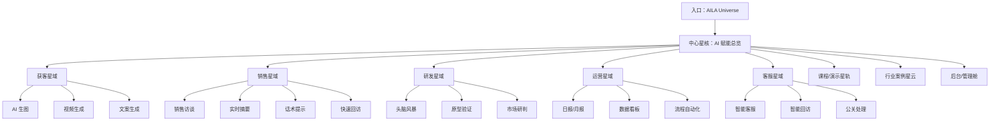
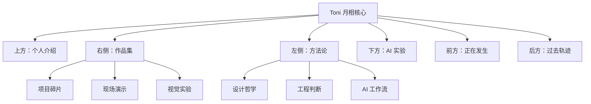

# AILA 四维宇宙界面统一设计文档

> 目标：把 AILA 从普通工具型网页升级成一个可探索的 AI 能力宇宙。用户不是在页面上“点菜单”，而是在一个无边际的空间里发现能力、进入场景、调用工具、观看演示和理解 AI 如何改造企业业务。

## 1. 参考来源与可访问性结论

### 已完整访问并提取

- `https://milopet.com/?ref=land-book.com`
  - 价值：复杂服务讲清楚、信任闭环、重复 CTA、FAQ 和法律/合作方背书。
  - 可借鉴给 AILA：把复杂 AI 能力拆成“痛点 -> 简单步骤 -> 明确结果”，让企业主不迷路。

- `https://lue.studio/?ref=onepagelove`
  - 价值：云、月、炼金术、极大留白、章节编号、漂浮式作品展示、诗性品牌叙事。
  - 可借鉴给 AILA：空间感、梦境感、探索感、轻量章节叙事，以及“少即是多”的高级感。

- `https://digitalflagship.com/?ref=land-book.com`
  - 价值：超强首屏、服务目录、案例证据、反复 CTA、深色/高亮对比。
  - 可借鉴给 AILA：把能力模块做成高识别的宇宙节点，用强 CTA 引导进入体验。

### 无法完整访问

- `https://land-book.com/websites/93327-digital-flagship`
  - 结果：返回 403，不能作为完整提取来源。

## 2. 一句话定位

AILA 是一个面向企业 AI 培训和现场演示的沉浸式 AI 操作系统。它把获客、销售、研发、运营、客服等企业业务环节变成可探索、可演示、可调用的空间节点，让企业主像进入宇宙地图一样理解 AI 如何改造业务。

## 3. 设计目标、边界与成功标准

### 设计目标

- 让 AILA 首屏从“普通应用首页”变成“进入 AI 宇宙”的入口。
- 让企业主在空间中理解 AI 能力，不靠长文档硬讲。
- 让培训现场可以一边讲课，一边在空间里跳转到对应业务模块。
- 让每个模块既有视觉震撼，也有清晰的业务结果。
- 让后续功能仍能扩展成新的星球、轨道、空间层和演示场景。

### 设计边界

- 不做纯炫技 3D。每个空间物体都必须对应真实功能、课程内容或业务场景。
- 不让用户迷失。宇宙可以无边，但当前路径、返回入口、主导航必须始终可见。
- 不一次性做完整 4D 物理模拟。先用 3D 空间 + 视差 + 层级深度模拟“四维探索感”。
- 不接外部 AI API。项目规则要求 AI 交互走 `/api/ai/chat/route.ts` Mock 引擎。
- 不复制参考站图片、Logo、文案和素材，只抽取结构与气质。

### 成功标准

- 用户 5 秒内知道：这里是 AILA，一个企业 AI 能力宇宙。
- 用户 20 秒内能进入一个具体业务模块，如获客、销售、研发、运营或客服。
- 用户在空间移动时不会丢失方向，有清楚的“回到中心”机制。
- 视觉上有宇宙、深度、漂浮、立体文字和探索感。
- 业务上仍然清楚：每个节点解决什么问题、产出什么结果、如何开始。
- Toni 的个人介绍和作品集必须比企业工具区更梦境、更 4D、更像可漫游的个人精神空间，而不是普通个人主页。

## 4. 核心体验概念：AILA Universe

你的描述可以翻译成一个产品概念：

> AILA Universe 是一个可导航的三维 AI 能力星图。文字、工具、案例、课程和演示不再是平面卡片，而是漂浮在空间中的立体节点。用户可以前后、上下、左右移动，靠近一个节点时，它会展开为可操作的业务工具或演示页面。

这里说的“四维空间”不需要真的做数学意义上的四维。用户感知到的关键是：

- 有前后深度。
- 有上下左右自由移动。
- 有远处内容逐渐靠近。
- 有文字和元素漂浮在不同层。
- 有星云、轨道、光点、坐标和空间雾。
- 有一种“越探索越多”的无边感。

## 5. 信息架构

## 6. 首页/主界面模块

### 1. 宇宙入口 Hero

首屏不做普通标题区，而是一个可进入的 3D 空间。

内容：

- 中央巨大立体文字：`AILA`
- 副标题：`Enterprise AI Universe`
- 漂浮文案：`让企业业务进入 AI 轨道`
- 背景：深色宇宙、微弱星尘、远处轨道线、淡淡空间雾。
- 主 CTA：`进入宇宙`
- 次 CTA：`查看课程路径`

交互：

- 鼠标移动时，AILA 字体有轻微视差。
- 点击“进入宇宙”后，镜头向前推进到中心星核。
- 滚轮也可以推进镜头，但要有节制，不能晕。

### 2. 中心星核：AI 赋能总览

这是整个系统的“太阳”。

内容：

- 中央球体或发光核心：`AI Operating Core`
- 周围 5 个主星域：获客、销售、研发、运营、客服。
- 每个星域旁边有短句说明业务结果。

示例：

- 获客：`批量生成广告内容和转化素材`
- 销售：`实时理解客户对话并提示下一句`
- 研发：`把想法快速变成可验证原型`
- 运营：`让重复工作自动流动`
- 客服：`把响应、回访和公关变成智能流程`

### 3. 星域探索

用户靠近某个星域时，它展开成多个工具节点。

节点结构：

- 节点名。
- 1 句话价值。
- 入口按钮。
- 状态标签：可体验、演示中、课程模块、即将开放。

从 Milo 借鉴：复杂能力必须讲简单。每个节点都用“输入什么 -> AI 做什么 -> 得到什么”说明。

### 4. 案例星云

把行业案例做成漂浮案例碎片，而不是普通列表。

行业：

- 电商。
- 外贸/出海。
- 制造。
- 快消服务。
- 农业。
- 行政/后勤。

每个案例节点结构：

- 行业。
- 痛点。
- AI 工具组合。
- 结果。
- 进入演示。

### 5. 课程星轨

把 2 天培训课程做成轨道式路径。

轨道结构：

- D1 上午：大模型趋势与认知冲击。
- D1 下午：行业案例 + 现场实战。
- D2 上午：AI 工具实操与企业落地。
- D2 下午：自由交流/主题工作坊。

每个课程节点可以展开：

- 讲什么。
- 为什么讲。
- 现场演示工具。
- 对企业主的影响。

### 6. 信任与解释层

从 Milo 借鉴：越复杂的东西越要讲清楚。

需要固定存在的解释层：

- AILA 能做什么。
- 企业主为什么现在需要它。
- 每个工具如何输入和输出。
- 现场培训如何使用。
- 数据和权限如何处理。

### 7. 底部/返回机制

宇宙界面不能没有地面。必须有稳定的控制区：

- 左下：当前位置路径。
- 中下：返回中心。
- 右下：打开工具面板。
- 右上：全局搜索。
- 顶部：课程/工具/案例/设置快速入口。

## 7. 视觉方向

### 情绪关键词

- 宇宙。
- 未来。
- 深邃。
- 高级。
- 现场演示震撼。
- 企业级可信。
- 探索感。
- 不像 PPT，不像后台，也不像普通 SaaS。

### 从参考站提炼

Milo 给 AILA 的启发：

- 把复杂系统讲清楚。
- 反复给用户明确下一步。
- 用 FAQ/解释层降低焦虑。

Lue 给 AILA 的启发：

- 空间感来自留白、漂浮、慢节奏和诗性物件。
- 不要把内容堆满。
- 每个章节像一次抵达。

Digital Flagship 给 AILA 的启发：

- 首屏要有强烈记忆点。
- 服务能力要像目录一样一眼扫清楚。
- CTA 要稳定、明确、反复出现。

## 8. 色彩系统

项目原本的暖白/琥珀设计语言更适合普通工具页。AILA Universe 建议作为独立沉浸主题，但仍保留琥珀作为品牌能量色。

| 用途 | 颜色 | 说明 |
|---|---:|---|
| 深空背景 | `#050711` | 主背景，避免纯黑 |
| 星云蓝 | `#1C6BFF` | 空间深度、科技感 |
| 能量青 | `#35F2D0` | AI 节点、连接线 |
| 品牌琥珀 | `#D97706` | 关键 CTA，与项目既有规范衔接 |
| 亮白文字 | `#F7F7F2` | 主标题和高亮文字 |
| 次级文字 | `#A7AAB8` | 说明文本 |
| 空间线框 | `rgba(255,255,255,0.12)` | 轨道、网格、坐标 |
| 节点玻璃 | `rgba(255,255,255,0.08)` | 面板和浮层 |

## 9. 字体与立体文字

### 标题

- 使用粗而窄的 Display 字体，适合做 3D 几何文字。
- AILA 主字标建议做成立体挤出文字，有金属/玻璃边缘。
- 中文标题不要过度挤压，保证培训现场投屏可读。

### 正文

- 使用清晰无衬线，如 Inter、Geist、Arial。
- 正文不要进入 3D 旋转太多，否则阅读困难。
- 大段解释永远放在 2D 浮层或 HUD 面板里。

### 立体文字使用规则

可以立体化：

- AILA。
- 获客、销售、研发、运营、客服。
- AI Operating Core。
- 课程大章节。

不要立体化：

- FAQ 长文本。
- 表单。
- 操作说明。
- 报告结果。

## 10. 空间交互设计

### 基础移动

桌面端：

- 鼠标拖拽：旋转视角。
- 滚轮：前进/后退。
- `WASD`：平移探索。
- `Space`：回到中心。
- `Esc`：退出当前节点。

移动端：

- 单指拖动：旋转视角。
- 双指缩放：前进/后退。
- 底部固定按钮：回中心、打开目录、进入当前节点。

### 节点接近行为

当用户靠近节点：

1. 节点发光增强。
2. 文字从空间里正对镜头。
3. 出现 2D 信息浮层。
4. CTA 变为可点击。
5. 背景星域轻微降噪，避免干扰阅读。

### 防迷路机制

- 永远显示当前星域名。
- 永远有“回到中心”按钮。
- 星域之间有可见轨道线。
- 第一次进入时给 10 秒引导。
- 提供“目录模式”，一键切回传统列表。

## 11. 页面/功能层级

### 第一层：宇宙总览

目的：震撼、建立概念、让用户知道 AILA 很不一样。

### 第二层：星域

目的：按企业业务链路组织能力。

### 第三层：工具

目的：进入真实可操作功能。

### 第四层：结果

目的：展示 AI 输出、报告、素材、摘要或演示结果。

### 第五层：课程叙事

目的：培训现场讲解时，把空间当作动态 PPT 和工具入口。

### 第六层：Toni 个人宇宙

目的：展示 Toni 的个人介绍、作品集、创作哲学和 AI 实验。这里不应该沿用企业工具区的强功能结构，而要更接近“梦境空间中的个人档案馆”。

它和企业星域的区别：

- 企业星域：清楚、可解释、可演示、像业务地图。
- Toni 个人宇宙：诗性、漂浮、可漫游、像进入一个人的脑内宇宙。
- 企业星域强调“AI 如何改造业务”。
- Toni 个人宇宙强调“Toni 是怎样思考、创造和使用 AI 的”。

## 12. Toni 个人作品集与个人介绍方向

这一部分需要特别强调：Toni 的个人页不是普通“关于我 + 项目卡片”。它应该是整个 AILA 中最 4D、最云月、最梦境、最有探索感的区域。

### 核心概念

> Toni Archive 是漂浮在 AILA 宇宙深处的一座个人月相档案馆。作品、经历、方法论、实验和自我介绍不是按页面排列，而是像记忆碎片一样悬浮在空间中。用户可以靠近、旋转、穿过、展开这些碎片，从不同角度理解 Toni。

### 入口设计

从 AILA 主宇宙进入 Toni 个人宇宙时，不要直接跳普通页面。建议设计成一个“月门”：

- 远处出现一轮半透明月亮。
- 月亮后方有云层和微弱星点。
- 鼠标靠近时，月亮产生轻微潮汐波纹。
- 点击后镜头穿过云层，进入 Toni 的个人空间。

入口文案：

> Toni

> The person behind the system.

> 进入个人宇宙

### 空间结构

Toni 个人宇宙不按传统导航组织，而按“方向”组织：

### 关键模块

#### 1. 月相自我介绍

不是头像 + 简历，而是一段缓慢浮现的自述。

内容建议：

- Toni 是谁。
- 为什么做 AILA。
- 对 AI、设计、培训、企业赋能的理解。
- 个人气质：高级、克制、锋利、有创造力。

视觉：

- 文字漂浮在云雾中。
- 每一段文字像月相一样逐步显影。
- 背后有很慢的星点和深蓝云层。

#### 2. 作品星群

作品不是卡片网格，而是一组可靠近的星体。

每个作品节点包含：

- 项目名。
- 一句项目定位。
- 视觉缩略片。
- Toni 在其中的角色。
- 可展开的案例叙事：背景、挑战、方案、结果。

交互：

- 靠近作品时，缩略图从薄片变成立体空间盒。
- 拖动可从不同角度看项目。
- 点击进入时，项目详情像一条时间隧道展开。

#### 3. 方法论轨道

展示 Toni 的思考方式，而不是只列技能。

可分为：

- 产品判断。
- 设计审美。
- AI 工程化。
- 现场培训。
- 从 0 到 1 构建。
- 企业主沟通。

视觉：

- 每个方法论是一条轨道。
- 轨道上有关键词、案例和短句。
- 用户可以沿轨道滑动，像读一个人的思维路径。

#### 4. AI 实验室

这里可以更未来、更交互。

内容：

- AI 生图实验。
- 演示工具原型。
- 课程片段。
- Prompt 工作流。
- 现场业务改造案例。

交互：

- 实验像漂浮仪器。
- 点击后打开小型演示窗口。
- 可以有“生成中”“推演中”“回放中”的状态。

#### 5. 联系/合作月台

不要做普通表单页。可以做成一个安静的空间终点。

内容：

- 合作邀请。
- 邮箱/微信/社交入口。
- 适合合作的项目类型。

文案方向：

> 如果你也想把 AI 变成一次真正能被看见、被理解、被执行的体验，我们可以聊聊。

### 视觉语言

Toni 个人宇宙的视觉要比 AILA 企业星域更柔、更深、更有梦感。

| 用途 | 颜色 | 说明 |
|---|---:|---|
| 梦境深空 | `#050713` | 主背景 |
| 月光白 | `#F4F7FF` | 主标题和月亮材质 |
| 云雾蓝 | `#A8C7FF` | 云层、远景、柔光 |
| 灵感金 | `#D9B66F` | 关键记忆点和作品高亮 |
| 玻璃灰 | `rgba(255,255,255,0.10)` | 漂浮面板 |
| 暗紫阴影 | `#171225` | 深度和空间边界 |

### 动效原则

- 慢。
- 轻。
- 有深度。
- 像在水下或云层里移动。
- 不要赛博朋克，不要霓虹爆炸，不要粒子乱飞。

允许：

- 云层缓慢漂移。
- 月亮轻微旋转。
- 文字有 3D 深度和微弱浮动。
- 作品节点随视角改变产生空间层次。
- 点击节点时相机缓慢推进。

禁止：

- 快速旋转。
- 高频闪烁。
- 过多发光边框。
- 大量 HUD 面板覆盖梦境感。
- 把个人介绍做成后台卡片。

### 和 AILA 企业宇宙的关系

AILA 企业宇宙是“外层系统”，Toni 个人宇宙是“内层精神空间”。

用户体验应该像这样：

1. 进入 AILA，看见企业 AI 能力地图。
2. 使用者知道这里能解决业务问题。
3. 进一步探索，发现 Toni 个人月相空间。
4. 用户理解这个系统背后的人、审美、判断和创造力。
5. 作品集和个人介绍共同增强信任，而不是打断产品体验。

## 13. 文案骨架

### 首屏

> AILA

> 一个为企业 AI 赋能培训打造的沉浸式操作系统。

> 从获客到售后，把每一个业务环节变成可探索、可演示、可落地的 AI 星域。

CTA：

> 进入宇宙

> 查看课程路径

### 中心星核

> 企业不是缺 AI 工具，而是缺一张能看懂业务全局的 AI 地图。

### 获客星域

> 批量生成广告图、视频脚本和转化文案，让流量入口更快被验证。

### 销售星域

> 听懂客户正在犹豫什么，并在对话中给出下一句建议。

### 研发星域

> 把会议里的想法快速压缩成原型、需求和验证路径。

### 运营星域

> 把日报、月报、回访、数据分析这些重复工作交给流程。

### 客服星域

> 让响应、回访和公关处理更稳定、更快、更有温度。

### 课程星轨

> 两天时间，不只是认识 AI，而是亲手看见它如何进入业务。

## 14. 组件系统

### Space Node 空间节点

用途：主星域、工具入口、课程节点。

内容：

- 3D 图标或发光球。
- 节点名称。
- 简短说明。
- 状态标签。
- 进入按钮。

### HUD Panel 解释面板

用途：承载可读信息。

特点：

- 半透明玻璃背景。
- 固定在屏幕边缘或节点附近。
- 字号稳定，不随 3D 透视过度变化。

### Orbit Nav 轨道导航

用途：让用户知道业务链路顺序。

结构：

- 前期。
- 营销。
- 销售。
- 研发。
- 运营。
- 售后。

### Command Dock 命令停靠栏

用途：全局控制。

按钮：

- 回到中心。
- 搜索能力。
- 打开课程。
- 打开工具列表。
- 切换低动效模式。

### Demo Portal 演示入口

用途：从宇宙进入真实工具页面。

状态：

- 预览。
- 进入演示。
- 生成中。
- 完成。
- 出错。

## 15. 技术实现建议

### 推荐栈

| 层 | 建议 | 原因 |
|---|---|---|
| 框架 | Next.js 16 + React 19 | 与当前项目一致 |
| 3D | Three.js + React Three Fiber | 适合 React 中管理 3D 场景 |
| 3D 辅助 | Drei | 文字、相机、控制器、环境更快落地 |
| 动效 | Framer Motion | 2D 面板、HUD、页面切换 |
| 图标 | Lucide React | HUD 和工具按钮 |
| 状态 | Zustand 或 React Context | 管理当前星域、相机状态、选中节点 |
| 持久化 | localStorage | 保存上次位置、低动效偏好 |

### 分阶段落地

第一阶段：可用的 2.5D 宇宙

- 深色背景。
- 星点 Canvas。
- 2D/3D 混合节点。
- 鼠标视差。
- 点击节点打开面板。

第二阶段：真实 3D 星图

- 引入 Three.js。
- 星域节点放入 3D 空间。
- 相机推进、轨道线、3D 文字。
- 支持回中心和目录模式。

第三阶段：沉浸式演示系统

- 每个业务星域接入现有工具页面。
- 课程星轨接入 slides。
- 演示时支持键盘控制和全屏模式。

第四阶段：空间记忆与个性化

- 记录访问过的节点。
- 根据课程进度点亮星域。
- 自动生成企业专属 AI 地图。

## 16. 性能与可访问性约束

### 性能

- 首屏 3D 模型数量控制在 30 个以内。
- 星点用 InstancedMesh 或 Canvas，不要每个星点一个 DOM。
- 3D 文字只用于大标题和节点名。
- 复杂工具界面按需加载。
- 移动端默认降低粒子数量。
- 提供“低动效模式”。

### 可访问性

- 所有空间节点必须有对应的列表导航。
- 键盘可以完成核心路径。
- 低动效模式关闭相机飞行动画。
- 文字说明必须有 2D 可读版本。
- 颜色不能只靠发光区分状态。

## 17. AILA 设计语言总结

AILA 的新方向不是“科技蓝 SaaS 后台”，也不是“普通 PPT 工具”，而是：

> 一个把企业业务链路放进宇宙星图里的 AI 演示操作系统。

它应该同时具备三种气质：

- Lue 的诗性空间：云、光、留白、章节感、探索感。
- Milo 的清晰解释：复杂能力必须一眼懂，下一步必须明确。
- Digital Flagship 的强结构：模块有冲击力，服务目录清楚，CTA 稳定。

最终用户感受应该是：

> 我不是在看一个 AI 工具列表，而是在进入一张企业 AI 未来地图。每靠近一个节点，我都能看到一个业务问题如何被 AI 改造。

## 18. Do-not-copy 边界

不要复制：

- 参考站 Logo、图片、人物、素材和完整文案。
- Lue 的月亮、云和炼金术视觉原样。
- Milo 的保险条款、法律信息和联系方式。
- Digital Flagship 的深色高亮体系原样。

可以借鉴：

- Lue 的漂浮感、章节编号、诗性叙事和大留白。
- Milo 的清晰路径、FAQ、信任闭环和重复 CTA。
- Digital Flagship 的强首屏、服务目录和案例证明结构。

## 19. 推荐下一步

如果进入真实实现，先不要直接做完整无限宇宙。建议先做一个可控版本：

1. 在首页做 `AILA Universe` 首屏。
2. 做 5 个业务星域节点。
3. 点击节点打开 HUD 面板。
4. 面板里链接到现有工具页。
5. 加一个“目录模式”，确保培训现场不会因为 3D 迷路。

这样可以快速验证方向，同时保留后续升级成真正 3D 宇宙的空间。
